# Conexão Solidária

Plataforma digital desenvolvida para a ONG Esperança Solidária, com foco em escalabilidade, observabilidade e automação da gestão de doadores e campanhas de arrecadação.

---

## Repositórios

| Repositório | Descrição |
|---|---|
| [conexao-solidaria-api](https://github.com/Conexao-Solidaria-Hackaton-FIAP-2026/conexao-solidaria-api) | API principal |
| [conexao-solidaria-donation-worker](https://github.com/Conexao-Solidaria-Hackaton-FIAP-2026/conexao-solidaria-donation-worker) | Worker de processamento de doações |
| [conexao-solidaria-infra](https://github.com/Conexao-Solidaria-Hackaton-FIAP-2026/conexao-solidaria-infra) | Infraestrutura (Docker, Kubernetes, CI/CD) |

---

## Diagrama de Arquitetura

---

## Fluxo Principal

1. O doador autenticado envia uma doação via `POST /api/doacoes`
2. A API valida a campanha e registra a doação com status `Pendente`
3. A API publica um `DoacaoRecebidaEvent` no RabbitMQ
4. O donation-worker consome o evento da fila
5. O worker atualiza o `ValorArrecadado` da campanha no banco
6. O painel público reflete o novo valor arrecadado

---

## Tecnologias

| Categoria | Tecnologia |
|---|---|
| Backend | .NET 10, ASP.NET Core |
| Banco de dados | Microsoft SQL Server 2022 |
| Mensageria | RabbitMQ + MassTransit |
| Autenticação | JWT (JSON Web Tokens) |
| Observabilidade | Prometheus + Grafana |
| Orquestração | Kubernetes (Minikube) |
| Containerização | Docker + Docker Compose |
| CI/CD | GitHub Actions |
| Testes | xUnit |

---

## Justificativa — Escolha do Banco de Dados

Consulte o documento: [justificativa-banco-de-dados.pdf](../JustificativaTecnicaEscolhaDoBancoDeDados.pdf)

---

## Como rodar

Consulte o [README do repositório de infraestrutura](https://github.com/Conexao-Solidaria-Hackaton-FIAP-2026/conexao-solidaria-infra) para instruções completas de como subir toda a plataforma localmente.

---

## Grupo

- **Pedro Luperini Piza** - RM365457
    Discord: @Pedro Luperini - RM365457
- **Rafaela Nascimento Carvalho** - RM366364
    Discord: @Rafaela - RM366364

Hackathon PosTech FIAP 2026
